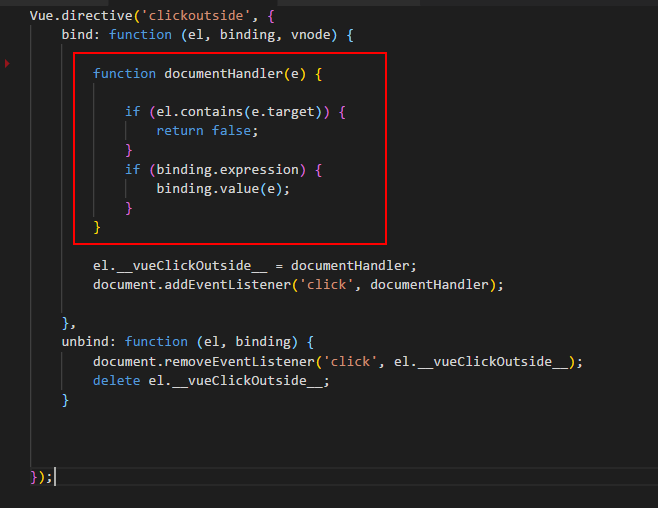

## 滑鼠點選按鈕，顯示選單
### 選單收回的方式
* 點選按鈕
* 點選按鈕和選單以外的視窗 (使用Directive控制)


> directive於bind鉤子函式中，利用contains來判斷點選的範圍有沒有包含main區塊的內容。如果
> 包含(按鈕或是選單)就回傳false，不做任何事情。如果未包含表示滑鼠點選選單以外的區域，則執行handleClose函式
```js
function documentHandler(e) {
        
        if (el.contains(e.target)) {
            return false;
        }
        if (binding.expression) {
            binding.value(e);
        }
    }

    el.__vueClickOutside__ = documentHandler;
    document.addEventListener('click', documentHandler);
```

[myimg]:rm01.png "我的圖片"

![myimg]

---
<a href="http://www.youtube.com/watch?feature=player_embedded&v=YOUTUBE_VIDEO_ID_HERE" target="_blank">
    
</a>


> handleClose函式寫在vue的方法中
```js
var app = new Vue({
    el: '#app',
    data:{
        show:false
    },
    methods:{
        handleClose:function(){
            this.show=false;
        }
    }

});
```


